# SonarQube – AromaLife Backend

## Nota: La VM donde se localiza SonarQube se elimino por efectos de costos, si quiere probar debe desplegar otra vez la VM usando los scripts proporcionados.

---

## 📘 Introducción

Este documento presenta un reporte completo de la implementación de **SonarQube** para el análisis de calidad de código del proyecto **AromaLife Backend**, un sistema de e-commerce desarrollado en NestJS/TypeScript.

El proyecto se desarrolló en dos fases:
- **Parte 1:** Implementación local usando Docker Compose
- **Parte 2:** Implementación en la nube de Azure con infraestructura como código (Terraform) y pipeline de CI/CD

**Contexto del Proyecto:**  
AromaLife es un proyecto de e-commerce de velas aromáticas que fue desarrollado previamente en un trabajo anterior del curso. Este reporte documenta la integración de herramientas de análisis de calidad y seguridad del código.

---

# 📦 PARTE 1: Implementación Local con Docker Compose

Esta primera fase consistió en configurar SonarQube localmente para realizar análisis de código estático.

## ⚙️ Paso 1: Configuración de Docker Compose

Se creó un archivo `docker-compose.yaml` para desplegar **SonarQube** y **PostgreSQL** localmente.

```yaml
sonarqube:
  image: sonarqube
  ports:
    - "9000:9000"
  networks:
    - sonarnet
  environment:
    SONARQUBE_JDBC_URL: jdbc:postgresql://db:5432/sonar
    SONARQUBE_JDBC_USERNAME: sonar
    SONARQUBE_JDBC_PASSWORD: sonar
  volumes:
    - sonarqube_conf:/opt/sonarqube/conf
    - sonarqube_data:/opt/sonarqube/data
    - sonarqube_extensions:/opt/sonarqube/extensions
    - sonarqube_bundled-plugins:/opt/sonarqube/lib/bundled-plugins

sonar-db:
  image: postgres
  networks:
    - sonarnet
  environment:
    POSTGRES_USER: sonar
    POSTGRES_PASSWORD: sonar
  volumes:
    - postgresql:/var/lib/postgresql
    - postgresql_data:/var/lib/postgresql/data
```

📸 **Captura: Configuración de Docker Compose**

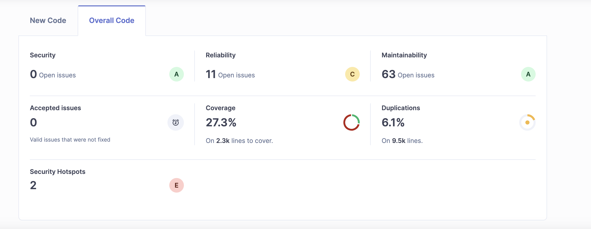

---

## 🧩 Paso 2: Configuración del Proyecto en SonarQube

Se configuró el archivo `sonar-project.properties` con los parámetros de análisis para el backend.

```properties
# Información del proyecto
sonar.projectKey=aromalife-backend
sonar.projectName=AromaLife Backend
sonar.projectVersion=1.0

# Directorios de código fuente y pruebas
sonar.sources=src
sonar.tests=test
sonar.exclusions=**/node_modules/**,**/*.spec.ts,**/test/**,**/dist/**,**/coverage/**,**/scripts/**,**/postgres-data/**,**/pgadmin-data/**

# Configuración TypeScript/JavaScript
sonar.typescript.lcov.reportPaths=coverage/lcov.info
sonar.javascript.lcov.reportPaths=coverage/lcov.info

# Codificación
sonar.sourceEncoding=UTF-8
```

📸 **Captura: Archivo sonar-project.properties**

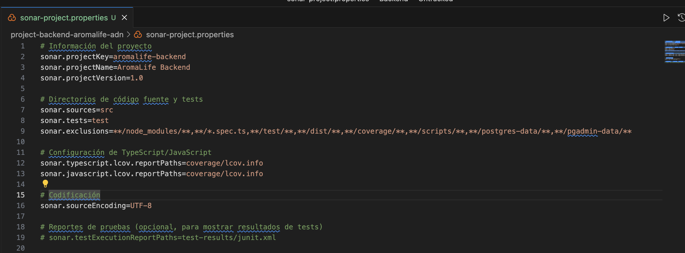

---

## 🚀 Paso 3: Ejecución del Análisis Local

Una vez SonarQube estuvo corriendo en `http://localhost:9000`, se ejecutó el análisis del proyecto:

```bash
sonar \
  -Dsonar.host.url=http://localhost:9000 \
  -Dsonar.token=sqp_3138e9c80c49bc501aded4f717490c087ae7174c \
  -Dsonar.projectKey=front
```

📸 **Captura: Vinculación del Proyecto y Dashboard**

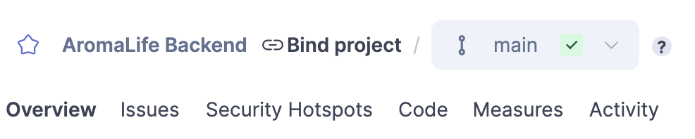

---

## 📊 Paso 4: Resultados del Análisis Local

Después de completar el análisis, los resultados fueron visibles en el dashboard de SonarQube.

📸 **Captura: Reporte de SonarQube Local**

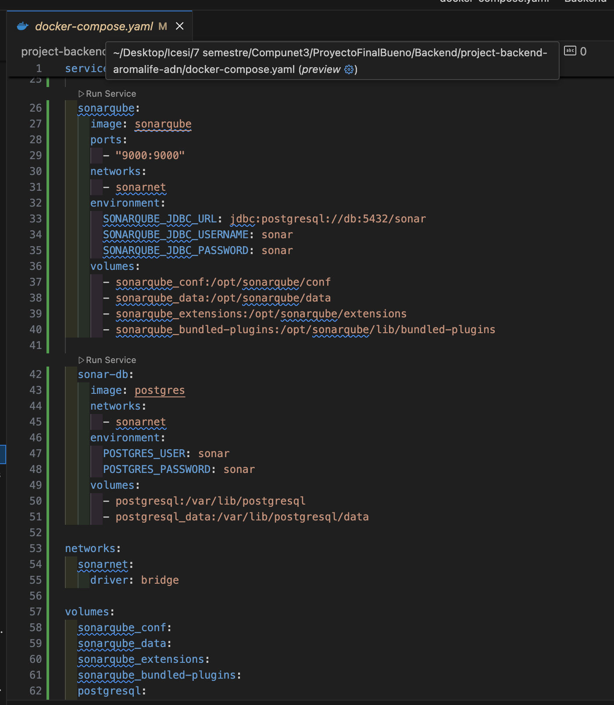

### ✅ Resumen de Resultados - Parte 1

| Métrica                  | Resultado             |
| ------------------------ | --------------------- |
| **Seguridad**            | 0 Issues Abiertos     |
| **Confiabilidad**        | 11 Issues (Grado A)   |
| **Mantenibilidad**       | 63 Issues (Grado C)   |
| **Cobertura**            | 27.3% (2.3k líneas)   |
| **Duplicaciones**        | 6.1%                  |
| **Hotspots de Seguridad**| 2 (Grado E)           |

---

# ☁️ PARTE 2: Implementación en Azure con Terraform y CI/CD

En esta segunda fase se implementó una infraestructura completa en Azure usando Terraform, integrando SonarQube en una máquina virtual y configurando un pipeline de CI/CD con GitHub Actions.

## 🏗️ Arquitectura de la Solución

```
┌─────────────────────────────────────────────────────────────────┐
│                         GitHub Repository                        │
│                     (davidone007/SonarQube)                      │
└───────────────────────────────┬─────────────────────────────────┘
                                │
                                │ Push Event
                                ▼
┌─────────────────────────────────────────────────────────────────┐
│                      GitHub Actions Pipeline                     │
│  ┌──────────────┐  ┌──────────────┐  ┌────────────────────┐   │
│  │ Trivy Scan   │  │ Tests +      │  │ SonarQube Analysis │   │
│  │ (Security)   │  │ Coverage     │  │                    │   │
│  └──────────────┘  └──────────────┘  └────────────────────┘   │
└───────────────────────────────┬─────────────────────────────────┘
                                │
                                │ Analysis Results
                                ▼
┌─────────────────────────────────────────────────────────────────┐
│                   Azure Cloud (East US)                          │
│  ┌───────────────────────────────────────────────────────────┐  │
│  │  Resource Group: rg-sonarqube-aromalife                   │  │
│  │                                                            │  │
│  │  ┌──────────────────────────────────────────────────┐    │  │
│  │  │ Virtual Machine (vm-sonarqube)                   │    │  │
│  │  │ - Ubuntu 22.04 LTS                               │    │  │
│  │  │ - Standard_D2s_v3                                │    │  │
│  │  │ - IP: 74.235.3.10                                │    │  │
│  │  │                                                   │    │  │
│  │  │  ┌─────────────────────────────────────────┐    │    │  │
│  │  │  │ Docker Containers                       │    │    │  │
│  │  │  │  ┌────────────┐  ┌──────────────┐      │    │    │  │
│  │  │  │  │ SonarQube  │  │ PostgreSQL   │      │    │    │  │
│  │  │  │  │ :9000      │  │ :5432        │      │    │    │  │
│  │  │  │  └────────────┘  └──────────────┘      │    │    │  │
│  │  │  └─────────────────────────────────────────┘    │    │  │
│  │  └──────────────────────────────────────────────────┘    │  │
│  │                                                            │  │
│  │  ┌──────────────┐  ┌─────────────┐  ┌──────────────┐    │  │
│  │  │ Virtual Net  │  │ Public IP   │  │ NSG (Firewall)│   │  │
│  │  │ 10.0.0.0/16  │  │ 74.235.3.10 │  │ Ports: 22,    │   │  │
│  │  │              │  │             │  │ 80, 443, 9000 │   │  │
│  │  └──────────────┘  └─────────────┘  └──────────────┘    │  │
│  └───────────────────────────────────────────────────────────┘  │
└─────────────────────────────────────────────────────────────────┘
```

---

## 🎯 Objetivos de la Parte 2

1. ✅ Desplegar SonarQube en una VM de Azure
2. ✅ Usar Terraform para infraestructura como código (IaC)
3. ✅ Integrar análisis de seguridad con Trivy
4. ✅ Configurar pipeline de CI/CD en GitHub Actions
5. ✅ Automatizar análisis en cada push al repositorio

---

## 📋 Paso 1: Selección de Suscripción de Azure

Se verificó y seleccionó la suscripción de Azure disponible.

📸 **Captura: Suscripción de Azure**

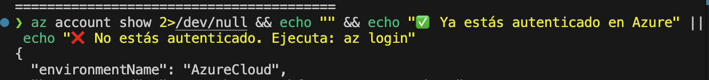

---

## 🛠️ Paso 2: Creación de Infraestructura con Terraform

Se crearon los archivos de Terraform para definir toda la infraestructura en Azure.

### Estructura de Archivos Terraform

```
terraform/
├── main.tf           # Definición de recursos de Azure
├── variables.tf      # Variables de configuración
├── terraform.tfstate # Estado de la infraestructura
└── scripts/
    └── init.sh       # Script de inicialización de la VM
```

### Ejecución del Plan de Terraform

```bash
cd terraform
terraform init
terraform plan -out=tfplan
```

📸 **Captura: Terraform Plan**

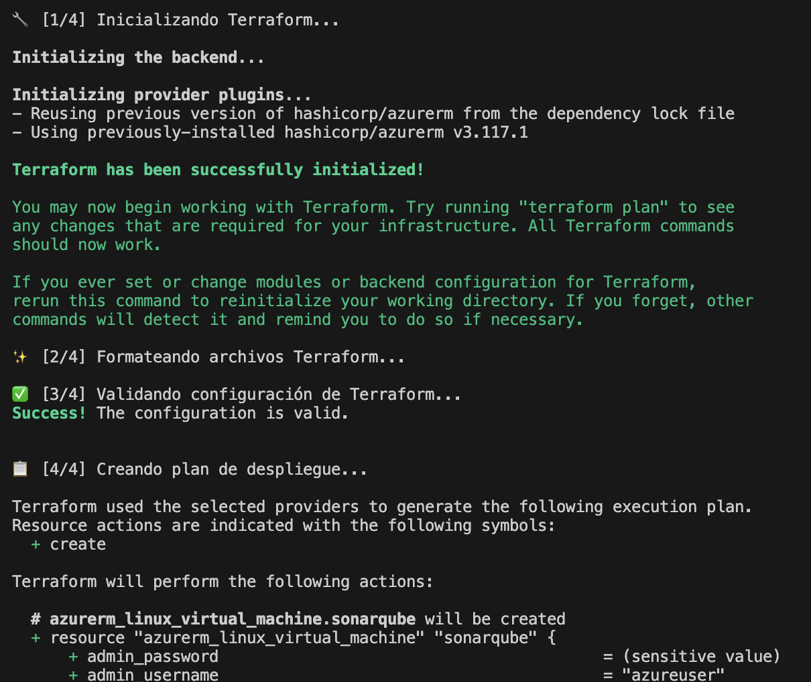

### Aplicación de la Infraestructura

```bash
terraform apply -auto-approve
```

📸 **Captura: Terraform Apply**

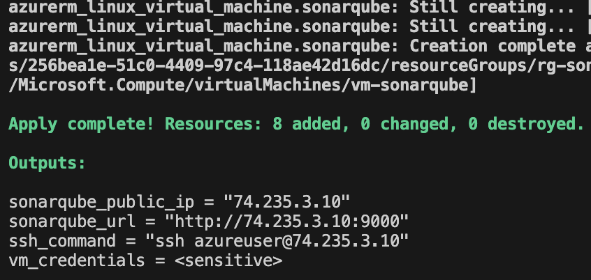

**Recursos Creados:**
- ✅ Resource Group: `rg-sonarqube-aromalife`
- ✅ Virtual Network: `vnet-sonarqube`
- ✅ Subnet: `subnet-sonarqube`
- ✅ Public IP: `pip-sonarqube`
- ✅ Network Security Group (NSG)
- ✅ Network Interface: `nic-sonarqube`
- ✅ Virtual Machine: `vm-sonarqube` (Ubuntu 22.04, Standard_D2s_v3)

**Tiempo de Despliegue:** ~90 segundos

---

## 📝 Paso 3: Información del Despliegue

Al finalizar, el script proporcionó la información de acceso:

📸 **Captura: Información de Despliegue**

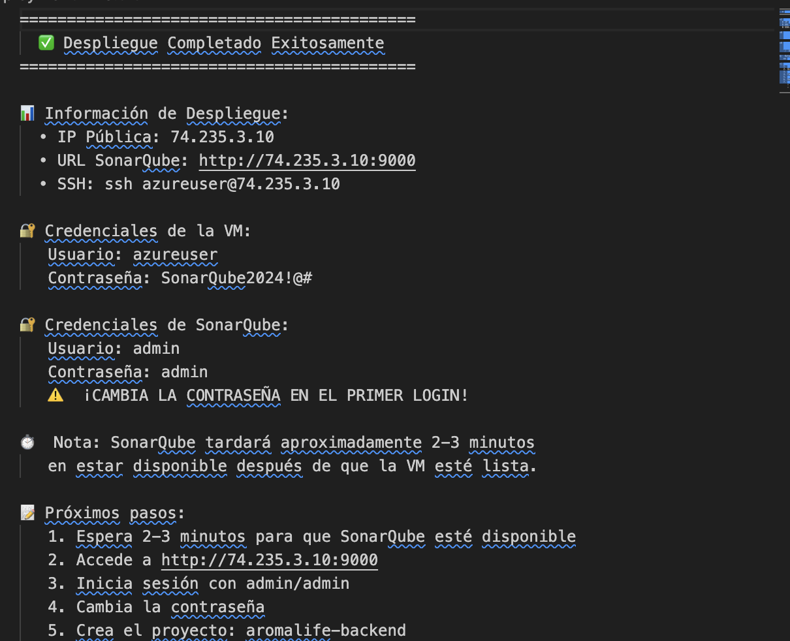

**Credenciales de Acceso:**
- **IP Pública:** 74.235.3.10
- **URL SonarQube:** http://74.235.3.10:9000
- **Usuario SSH:** azureuser
- **Contraseña:** SonarQube2024!@#

---

## 🔍 Paso 4: Verificación en Azure Portal

Se verificó que todos los recursos fueron creados correctamente en el portal de Azure.

📸 **Captura: Grupo de Recursos en Azure**

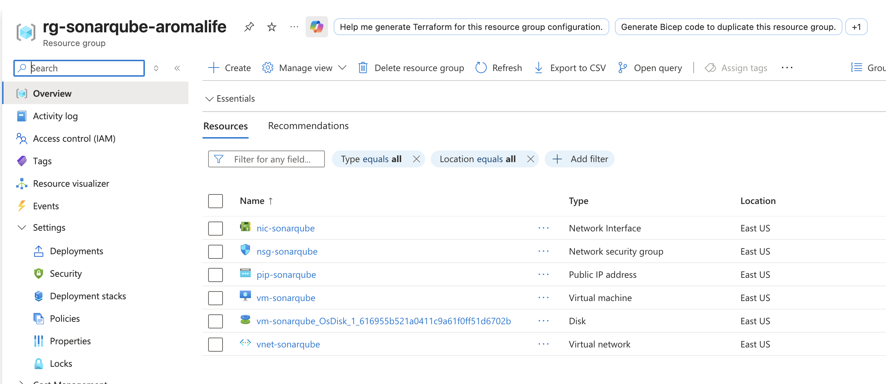

**Recursos Visibles:**
- Virtual Machine (vm-sonarqube)
- Network Interface
- Network Security Group
- Public IP Address
- Virtual Network
- Disk

---

## 🔐 Paso 5: Configuración Inicial de SonarQube

Se accedió a SonarQube mediante la URL `http://74.235.3.10:9000` y se completó la configuración inicial.

### Cambio de Contraseña Predeterminada

**Credenciales por defecto de SonarQube:**
- Usuario: `admin`
- Contraseña: `admin`

📸 **Captura: Cambio de Contraseña**

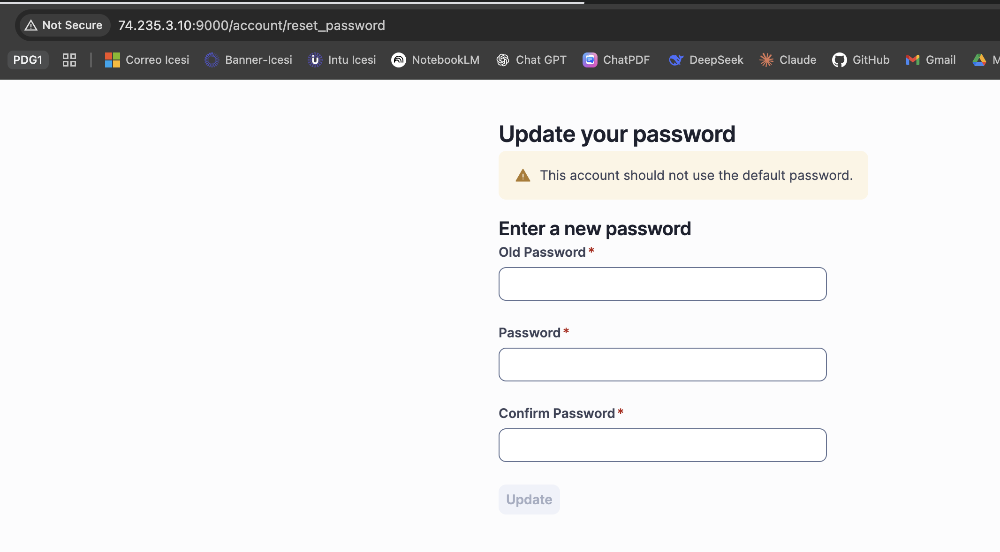

---

## 📦 Paso 6: Creación del Proyecto en SonarQube

Se creó el proyecto `aromalife-backend` en SonarQube y se generó el token de autenticación.

📸 **Captura: Creación del Proyecto**

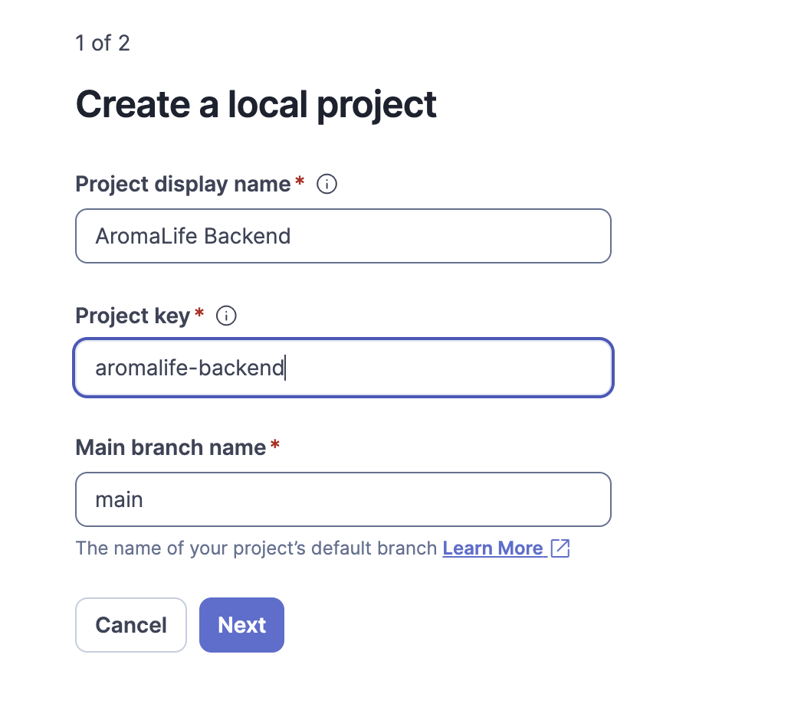


**Configuración del Proyecto:**
- **Project Key:** aromalife-backend
- **Project Name:** AromaLife Backend
- **Token generado:** (almacenado en GitHub Secrets)

---

## 🔑 Paso 7: Configuración de GitHub Secrets

Se configuraron los secrets necesarios en el repositorio de GitHub para la integración con SonarQube.

📸 **Captura: GitHub Secrets**

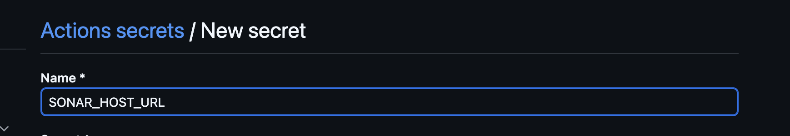

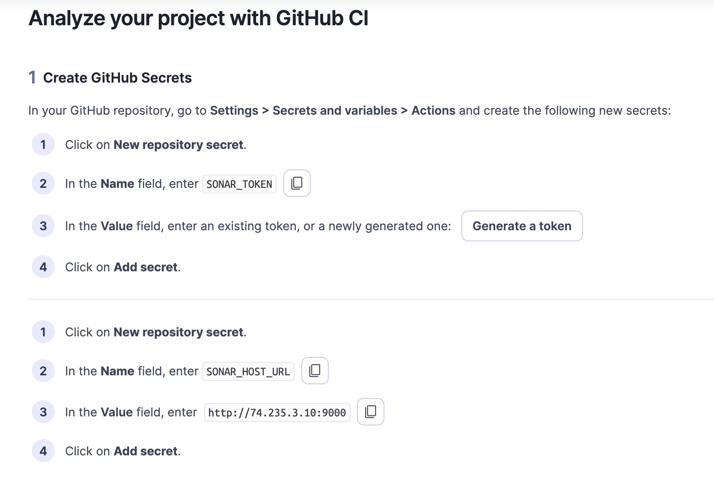

**Secrets Configurados:**
- `SONAR_TOKEN`: Token de autenticación de SonarQube
- `SONAR_HOST_URL`: http://74.235.3.10:9000

---

## 🚀 Paso 8: Pipeline de CI/CD con GitHub Actions

Se creó un workflow de GitHub Actions (`.github/workflows/sonarqube-pipeline.yml`) que se ejecuta en cada push.

### Estructura del Pipeline

El pipeline consta de 4 jobs principales:

1. **Trivy Security Scan:** Escaneo de vulnerabilidades en el código
2. **Tests & Coverage:** Ejecución de pruebas unitarias y cobertura
3. **SonarQube Analysis:** Análisis de calidad de código
4. **Security Report:** Consolidación de reportes de seguridad

### Trigger del Pipeline

```yaml
on:
  push:
    branches: ['**']  # Se ejecuta en cada push a cualquier rama
```

---

## ✅ Paso 9: Resultados del Pipeline

Después de hacer commit y push al repositorio, el pipeline se ejecutó automáticamente.

📸 **Captura: Pipeline de GitHub Actions**

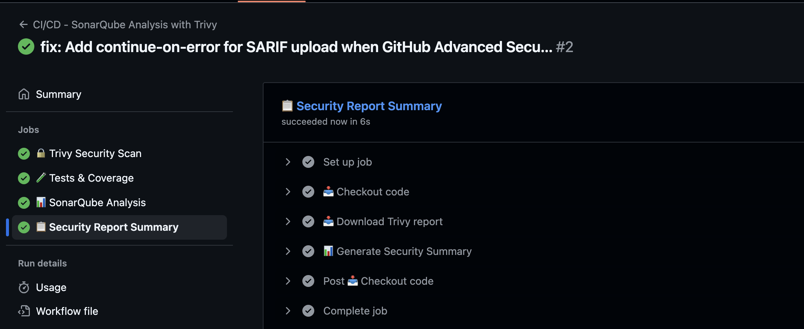

**Jobs Ejecutados:**
- ✅ Trivy Security Scan: Completado
- ✅ Tests & Coverage: Completado (27.3% cobertura)
- ✅ SonarQube Analysis: Completado
- ⚠️ Security Report: Completado con advertencia (SARIF upload requiere GitHub Advanced Security)

---

## 📦 Paso 10: Artefactos Generados

El pipeline genera y almacena varios artefactos para revisión posterior.

📸 **Captura: Artefactos del Pipeline**

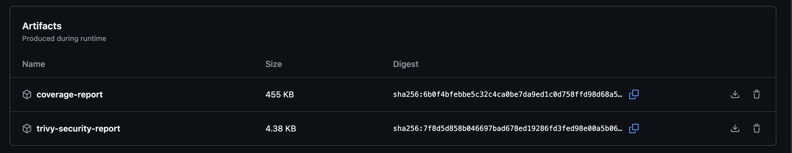

**Artefactos Disponibles:**
- `trivy-report-json`: Reporte de vulnerabilidades en formato JSON
- `trivy-report-sarif`: Reporte en formato SARIF
- `security-summary`: Resumen consolidado de seguridad

---

## 🎯 Paso 11: Quality Gate de SonarQube

Los resultados del análisis son visibles en el dashboard de SonarQube en Azure.

📸 **Captura: Quality Gate de SonarQube**

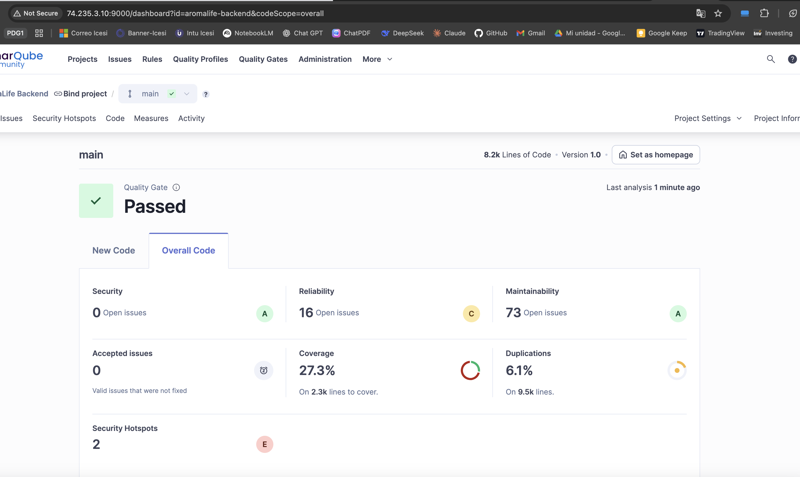

**Análisis Completado:**
- ✅ Código analizado correctamente
- ✅ Quality Gate pasado
- ✅ Métricas actualizadas en tiempo real

---

## 🛡️ Paso 12: Reporte de Seguridad

Al final en GitHub se genera un .md con un reporte de seguridad:

📸 **Captura: Resumen de Seguridad**

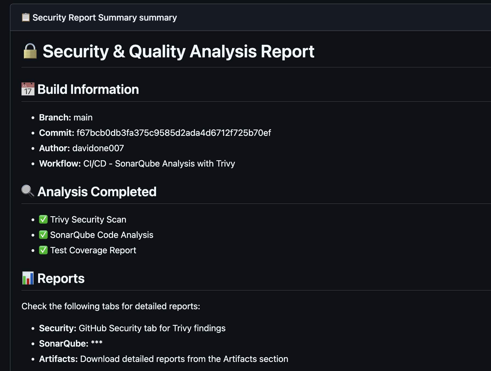

---

## 📊 Resumen de Resultados - Parte 2

### Infraestructura Desplegada

| Componente            | Detalle                                |
| --------------------- | -------------------------------------- |
| **Cloud Provider**    | Microsoft Azure                        |
| **Región**            | East US                                |
| **Resource Group**    | rg-sonarqube-aromalife                 |
| **VM Tipo**           | Standard_D2s_v3 (2 vCPUs, 8GB RAM)    |
| **Sistema Operativo** | Ubuntu 22.04 LTS                       |
| **IP Pública**        | 74.235.3.10                            |
| **SonarQube URL**     | http://74.235.3.10:9000                |

### Pipeline de CI/CD

| Característica         | Implementación                        |
| ---------------------- | ------------------------------------- |
| **Plataforma**         | GitHub Actions                        |
| **Trigger**            | Push a cualquier rama                 |
| **Escaneo Seguridad**  | Trivy                                 |
| **Análisis Código**    | SonarQube                             |
| **Cobertura Tests**    | Jest (27.3%)                          |
| **Artefactos**         | JSON, SARIF, Security Summary         |

### Herramientas Integradas

- ✅ **Terraform** v1.5.7: Infraestructura como código
- ✅ **Docker & Docker Compose**: Contenedorización
- ✅ **SonarQube Community**: Análisis de calidad
- ✅ **Trivy**: Escaneo de vulnerabilidades
- ✅ **GitHub Actions**: CI/CD automatizado
- ✅ **PostgreSQL**: Base de datos de SonarQube
- ✅ **Jest**: Framework de pruebas

---

## 🎓 Conclusiones

### Logros de la Parte 1
- ✅ Configuración exitosa de SonarQube local con Docker Compose
- ✅ Análisis inicial del código identificando 74 issues totales
- ✅ Cobertura de código del 27.3%
- ✅ Identificación de áreas de mejora en mantenibilidad

### Logros de la Parte 2
- ✅ Infraestructura completa desplegada en Azure usando Terraform
- ✅ Pipeline de CI/CD funcional con ejecución automática en cada push
- ✅ Integración de análisis de seguridad con Trivy
- ✅ SonarQube accesible públicamente para análisis continuo
- ✅ Automatización completa del proceso de análisis de calidad
- ✅ Generación de reportes de seguridad y calidad en cada build

### Beneficios Obtenidos
1. **Automatización:** Análisis automático en cada cambio de código
2. **Escalabilidad:** Infraestructura en la nube fácilmente escalable
3. **Seguridad:** Detección temprana de vulnerabilidades con Trivy
4. **Calidad:** Monitoreo continuo de métricas de código
5. **Trazabilidad:** Historial completo de análisis y resultados
6. **Infraestructura como Código:** Reproducibilidad total con Terraform

### Aprendizajes Clave
- Implementación de infraestructura cloud con Terraform
- Configuración de pipelines de CI/CD con GitHub Actions
- Integración de herramientas de análisis estático y seguridad
- Gestión de secretos y credenciales en entornos de CI/CD
- Despliegue y configuración de servicios en máquinas virtuales de Azure

---

## 📚 Referencias

- [SonarQube Documentation](https://docs.sonarqube.org/)
- [Terraform Azure Provider](https://registry.terraform.io/providers/hashicorp/azurerm/latest/docs)
- [GitHub Actions Documentation](https://docs.github.com/en/actions)
- [Trivy Scanner](https://aquasecurity.github.io/trivy/)
- [NestJS Testing](https://docs.nestjs.com/fundamentals/testing)

---

## 👨‍💻 Autor

**Davide Flamini**  


---


